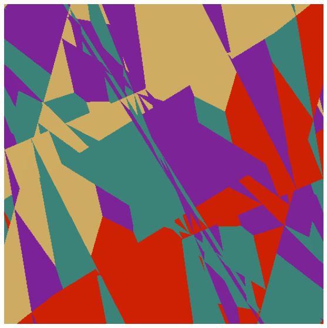

# 3D Graphics Systems Course - IMPA 2020

#### Professor Luiz Velho
#### Hallison Paz, 1st year PhD student
---------

## Rendering a Scene with a Differentiable Renderer

The objective of this 2nd assignment is to render a scene using a differentiable renderer and exploit some capabilities of this system. We aim to render equirectangular panoramas, building a scene with a single sphere parameterized by latitude and longitude and setting the câmera in the center of the sphere. You can find the [full source code here](https://github.com/hallpaz/3dsystems20/blob/master/Rendering%20Panoramas.ipynb).

### Modeling the Scene

First of all, we need to compute the geometry and texture coordinates for a sphere. A valid concern about textures is the possibility of distortion due to the mapping. We decided to parameterize the sphere in terms of latitude and longitude coordinates, as well as use an equirectangular panorama as a bidimensional texture for the interior of the sphere. With this representation, we have an image that takes into account the distortion of the surface.


For the geometry, we sample points uniformly as we increment the angles Phi and Theta in a spherical coordinate system. **0 <= Phi <= 2pi; 0 <= Theta < pi**. As the texture has a boundary and the sphere has not , we must be careful to achieve a good and meaningful result. Our strategy for a good mapping was:

##### Geometry  and Texture Coordinates

1. We don't close the sphere in the poles. 
As we can see in line #2, we define an **epsilon**, so that **Theta** actually varies from **epsilon** to **pi-epsilon** and the vertices of the poles are sampled very close to each other, but are still considered different elements.

2. We duplicate the vertices located over the first meridian
For each parallel, we sample two vertices on the exact same location of the first sample, which is equivalent to consider that Phi belongs to the closed interval **[0, 2PI]**. We do that to simplify the computations of  the texture reconstruction on the surface, as it can be done with a linear interpolation. Lines #19 to #25 implement this approach.

<script src="https://gist.github.com/hallpaz/1c218e01c893c120b61a661731234c30.js"></script>


**Mesh Triangulation**

We triangulate the mesh by connecting vertices on adjacent parallels and meridians over the surface. We choose the order of the vertices such that each face has a clockwise (CW) winding order. This way, the normals point to the interior of the surface where we wish to locate our camera.

<script src="https://gist.github.com/hallpaz/e4ab7e85c37d221cdd9e2381b8d541a5.js"></script>

In the end of the function we convert the lists of data into PyTorch tensors, so we have a data structure compatible with the operations 

### Rendering the Scene

[This tutorial](https://pytorch3d.org/tutorials/render_textured_meshes) in the PyTorch3D website shows how to set up a renderer to render a textured mesh. We use it as a starting point to our experiments.

##### Loading mesh data

The [tutorial] shows how to load an obj file into memory with material data to render a textured surface.  Our first approach was to try to write the computed the geometry of the mesh to an obj file with texture information. However, we discovered that the library does not support saving a mesh with texture coordinates yet and [it does not intent to add this feature soon](https://github.com/facebookresearch/pytorch3d/issues/151). To solve this problem, we figured how to use the Texture class out of the source code.

##### Setting the scene parameters

First, we tried to reproduce the tutorial steps to check if the texture data is fine and see what would be rendered. 
We can see part of the the texture represented in a spherical form in an image that looks a little dark. This result seems fine as we are looking to the sphere from the outside and the normals of the faces points inward the surface. 


After that, we moved the camera and the light source to the center of the sphere, decreasing the near clipping plane to 0.5 as the radius of the sphere is equal to 1.0. For our surprise the result was only a black screen.


We decided to put the camera outside the sphere again and render some intermediate images as we move the camera towards the center of the sphere. 

<figure>
		
	<figcaption>Câmera located at point [0.0, 0.0, 2.1] (outside)</figcaption>
</figure>

<figure>
		
	<figcaption>Câmera located at point [0.0, 0.0, 1.2] (outside)</figcaption>
</figure>

<figure>
	
	<figcaption>Câmera located at point [0.0, 0.0, 0.9] (inside)</figcaption>
</figure>

<figure>
	
	<figcaption>Câmera located at points  [0, 0, 0.6] | [0, 0, 0.3] | [0, 0, 0.0] (inside)</figcaption>
</figure>

As we can see, as soon as the camera enters the surface, the visualization gives an unexpected result. Setting the camera anywhere inside the sphere but the center, appears to show a distorted visualization where we can't identify any object in the texture. In the center, we have a black screen. 

#### Investigating the unexpected results

##### Rendering the Mesh in MeshLab

The first test we did to check if the error was in our computations, was to export the mesh and open it on MeshLab. We wrote a simple function to write an obj file with texture coordinates for vertices and we copied the material used in the cow mesh, changing only the image used as texture. In MeshLab, everything was ok, so we discarded a problem with our geometry.

<video width="706"  height="458"  controls>  
<source src="img/meshlab_panorama_video.mp4" type="video/mp4">  
Your browser does not support the video tag.  
</video>

##### Moving the câmera in the tutorial

We decided to take the original code of the tutorial and move the camera towards the inside of the cow mesh. We could observe the exact same problem. We discarded issues related to the winding order and normal orientation of the faces.


##### Toy texture

We decided to use a very simple texture, represented by 4 large rectangles in different colors, to try to investigate the problem by looking to the result. 


Unfortunately, we couldn't identify any pattern in the rendered image that could lead us to a solution. At first, we can see that some regions show patterns that resemble self-intersections or visibility problems related to depth sorting or face culling. We already checked that our mesh is correct and has no self-intersections, but to investigate visibility problems, we need to understand the details of this particular implementation.

<figure>
	
	<figcaption>Camera located at point [0.0, 0.0, 0.3] (inside)</figcaption>
</figure>

However, in this case, when we render the scene with the camera located in the center of the sphere, we don't get a black screen. In computer graphics, a completely black screen scre

<figure>
	
	<figcaption>Camera located at point [0.0, 0.0, 0.0] (inside)</figcaption>
</figure>

##### Changing Renderer Settings

We tried to explore different sets of the parameters faces_per_pixel, bin_size and max_faces_per_bin, but we could't perceive any difference rendering the "toy texture". We tried both the coarse and coarse-to-fine rasterization as stated in the documentation.

```python
raster_settings = RasterizationSettings(
   image_size=512, 
   blur_radius=0.0, 
   faces_per_pixel=1, 
   bin_size = None,  # this setting controls whether naive or coarse-to-fine rasterization is used
   max_faces_per_bin = None  # this setting is for coarse rasterization
)
``` 

##### Moving the near clipping plane

An unexpected result

##### Looking for alternatives renderers

We tried to use the [TensorFlow Graphics](https://www.tensorflow.org/graphics/) to render the mesh, but we couldn't find information on how to render a textured mesh and it didn't appear we could achieve it on time. Our second alternative was the [Open Differentiable Renderer](http://open-dr.org/) (OpenDR). Although this have a nice documentation of the examples, including a paper detailing how they achieved this result, we couldn't run the examples. Later, we discovered it's written in Python 2, which is deprecated as of 2020, and it's not compatible with Python 3. Finding a way to render the scene in another similar differentiable renderer system, can help us understand if it's a problem related to the method or to the specific implementation in PyTorch3D. As we already spent a significant amount of time in this assignment, **this point remains inconclusive until now.**

### Conclusion

Cropping the mesh
<!--stackedit_data:
eyJoaXN0b3J5IjpbLTExMjQwOTY4OTksLTIwNTIyNzA2MzEsLT
Y4NjU2MzgxOSwtMTQ3NjM4ODk5MSwtODE1MDU2MTM3LC0xNzU0
NjMzMjUzLC0xMTcyMDM1NDAzLC01Mjc5NDY5MDQsMTI1NzE0MD
U3NSwxOTUxOTAzMjM0LC0yMDY5MzY4MzUxLDE4ODk5NTU1Njcs
LTEyNTg0MDE0ODksLTU3OTkyMDQ5NywtODE1Njk5NDkyLC0xMT
gzNDIyNjA2LDQ1NzY3NTE5NywxNjQzODcyMDQwLC0xMDIzMTYz
NTI1LC00NjIzNDI2N119
-->