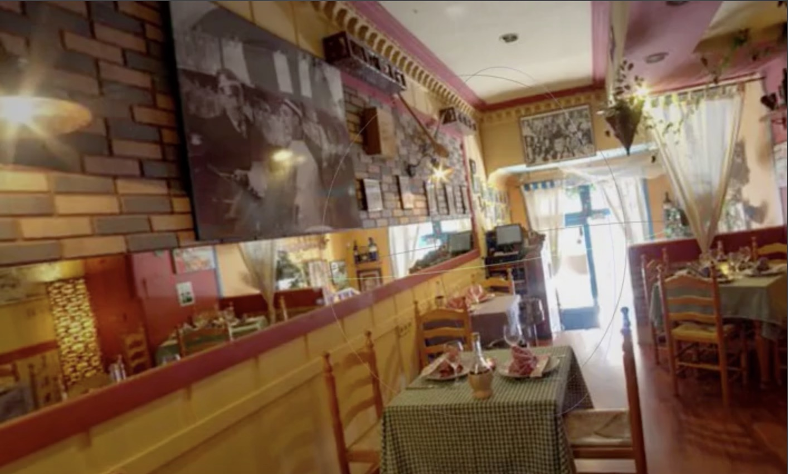

# 3D Graphics Systems Course - IMPA 2020

#### Professor Luiz Velho
#### Hallison Paz, 1st year PhD student

---------

## Final Project 

#### [AI Graphics | Differentiable Rendering](project.md) \[under construction]

This project builds on the previous assignments of 3D modeling and scene visualization using PyTorch3D, one of the AI graphics platforms available for free. Our goal is to_Render a panoramic scene using a differentiable renderer and exploit the inverse rendering to augment a scene.  [READ MORE...](project.md)

## Assignments

#### [Rendering a Scene with a Differentiable Renderer](assignment2.md)

The objective of this 2nd assignment is to render a scene using a differentiable renderer and exploit some capabilities of this system. We aim to render equirectangular panoramas, building a scene with a single sphere parameterized by latitude and longitude and setting the câmera in the center of the sphere. [READ MORE...](assignment2.md)

#### [Exploring the PyTorch3D Library for Modeling](assignment1.md)

The objective of this 1st assignment is to get familiarized with the AI Graphics platform [Pytorch3D](https://pytorch3d.org/). To achieve this, I read though the available [documentation](https://pytorch3d.org/docs/why_pytorch3d) and [tutorials](https://pytorch3d.org/tutorials) and started doing some experiments focused on 3D modeling topic. [READ MORE...](assignment1.md)

<!--stackedit_data:
eyJoaXN0b3J5IjpbMTA3Mjc5MTE2LDYwODY1NDgyMSwtMTg4Mj
U0MDM1NCwtMTE3NDU5NzU2OSwtMzg2MjQ1MTcsMTQ5Mjc5OTc1
MCw0ODQ2MDM4MSwtMTQ2NTgyODMxOSwtMTk1MDE3MjY5MSwtMT
I1MTE5OTA1Myw5MjcwMTEyODQsLTEyODQ5OTAzMzQsMTc0MTQz
MTgwNSwtMTE3NDIzOTUzMSwtMTQzNDQxMDYzNCwtNTQyNDg2Mz
ExLC0xMzgxNTcwNDMxLDE0MjY0NTY2OSwtMTYwNTE2MTE0OCwt
MTkzODUzMDM5OF19
-->