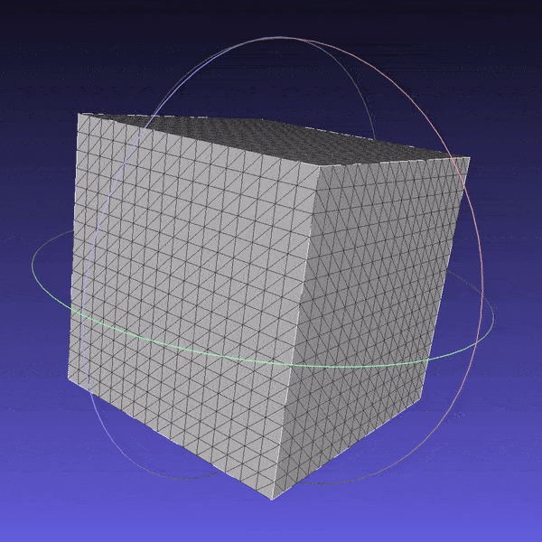

# 3D Graphics Systems Course - IMPA 2020

#### Professor Luiz Velho
#### Hallison Paz, 1st year PhD student

## Assignment 1 - Exploring PyTorch3D library

The objective of this assignment is to get familiarized with the AI Graphics platform [Pytorch3D](https://pytorch3d.org/). To achieve this, I read though the available [documentation](https://pytorch3d.org/docs/why_pytorch3d) and [tutorials](https://pytorch3d.org/tutorials) and started doing some experiments focused on 3D modeling topic.

### Creating primitives with PyTorch3D

PyTorch3D was designed to work with 3D meshes. Because of that, I started trying to understand how to operate with [the Mesh data structure of the library](https://pytorch3d.org/docs/batching). While running the tutorials, I discovered that the library has one module called "[utils](https://github.com/facebookresearch/pytorch3d/tree/master/pytorch3d/utils)" where there are functions to generate a sphere and a torus meshes as primitives. It seemed to me that writing my own functions to generate other primitive forms could be a good exercise to understand the PyTorch3D meshes. Besides that, if I managed this well, this  work could be submitted as a contribution to the library as it's open source.

First, inspired by the availability of primitives in [Blender](https://docs.blender.org/manual/en/latest/modeling/meshes/primitives.html) and [Unity](https://docs.unity3d.com/Manual/PrimitiveObjects.html), I created a cube and a cylinder, basic shapes that were missing in PyTorch3D. The shapes were added in a manner fully compatible with the library.

* [Source Code](https://github.com/hallpaz/3dsystems20/blob/master/extensions_utils/cube.py) for the cube.

* Cube mesh subdivided 4 times.

* [Source Code](https://github.com/hallpaz/3dsystems20/blob/master/extensions_utils/cylinder.py) for the cylinder.

* Cube mesh subdivided 4 times.

After these well succeeded attempts, I wrote a function to generate meshes of surfaces of revolution. With this function, we would be able to generate many different meshes only varying the function that describes the generatrix curve. I added a parameter to indicate whether or not the mesh should be closed, with **True** as the default value; in this case, I implemented a naive approach, just connecting  the boundary vertices to a single point on the bottom or the top of the surface. The surfaces were computed as a revolution over the Z axis, using the following parametrization:

u [0, 1]
v [0, 2pi)
(ucos(v), usin(v), f(u)) where f is the generatrix

* [Source Code](https://github.com/hallpaz/3dsystems20/blob/master/extensions_utils/cylinder.py) for the revolution surface.

>> many images here

### Deforming Shapes

After creating new synthetic meshes compatible with Pytorch3D, I decided to explore the tutorial [Deform a source mesh to form a target mesh using 3D loss functions](https://pytorch3d.org/tutorials/deform_source_mesh_to_target_mesh#Deform-a-source-mesh-to-form-a-target-mesh-using-3D-loss-functions). The main goal was to understand the applicability of the library in the optimization of a mesh geometry using loss functions and backpropagation. 

The example code deforms a refined ico-sphere into a dolphin mesh using the chamfer distance and other three different metrics related to regularization and smoothness of the mesh: an edge length loss, a normal consistency loss and a laplacian regularizer. The example achieves a very good result under these conditions

Let's evaluate the impact of each type of loss function applied to the problem and verify some limitations of the method.

#### Experiments with the cube
You can find the [source notebook here]([https://github.com/hallpaz/3dsystems20/blob/master/non_smooth_experiments.ipynb](https://github.com/hallpaz/3dsystems20/blob/master/non_smooth_experiments.ipynb)) and check all the experiments.

#### Experiments with surfaces of revolution

You can find the [source notebook here]([https://github.com/hallpaz/3dsystems20/blob/master/non_smooth_experiments.ipynb](https://github.com/hallpaz/3dsystems20/blob/master/fairly_smooth_experiments.ipynb)) and check all the experiments.

<!--stackedit_data:
eyJoaXN0b3J5IjpbLTE5Mzg1MzAzOTgsMTE5MjYwNTcxNV19
-->