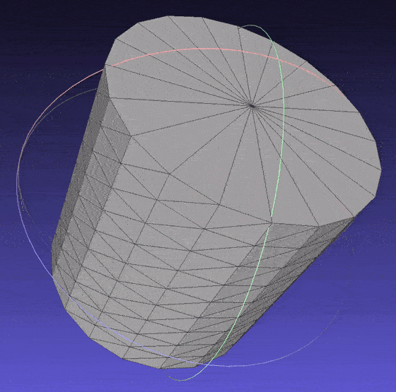
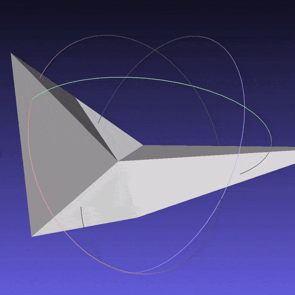
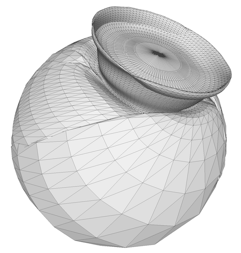
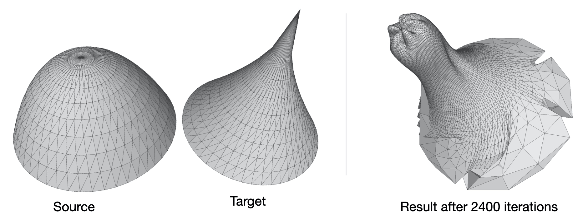

# 3D Graphics Systems Course - IMPA 2020

#### Professor Luiz Velho
#### Hallison Paz, 1st year PhD student

## Assignment 1 - Exploring PyTorch3D library

The objective of this assignment is to get familiarized with the AI Graphics platform [Pytorch3D](https://pytorch3d.org/). To achieve this, I read though the available [documentation](https://pytorch3d.org/docs/why_pytorch3d) and [tutorials](https://pytorch3d.org/tutorials) and started doing some experiments focused on 3D modeling topic.

### Creating primitives with PyTorch3D

PyTorch3D was designed to work with 3D meshes. Because of that, I started trying to understand how to operate with [the Mesh data structure of the library](https://pytorch3d.org/docs/batching). While running the tutorials, I discovered that the library has one module called "[utils](https://github.com/facebookresearch/pytorch3d/tree/master/pytorch3d/utils)" where there are functions to generate a sphere and a torus meshes as primitives. It seemed to me that writing my own functions to generate other primitive forms could be a good exercise to understand the PyTorch3D meshes. Besides that, if I managed this well, this  work could be submitted as a contribution to the library as it's open source.

####  Simple primitives

First, inspired by the availability of primitives in [Blender](https://docs.blender.org/manual/en/latest/modeling/meshes/primitives.html) and [Unity](https://docs.unity3d.com/Manual/PrimitiveObjects.html), I created a cube and a cylinder, basic shapes that were missing in PyTorch3D. The shapes were added in a manner fully compatible with the library.

* [Source Code](https://github.com/hallpaz/3dsystems20/blob/master/extensions_utils/cube.py) for the cube.

**Cube mesh subdivided 4 times.**

* [Source Code](https://github.com/hallpaz/3dsystems20/blob/master/extensions_utils/cylinder.py) for the cylinder.

**Cylinder mesh.**

####  Solids of revolution
After these well succeeded attempts, I wrote a function to generate meshes of surfaces of revolution. With this function, we would be able to generate many different meshes only varying the function that describes the generatrix curve. I added a parameter to indicate whether or not the mesh should be closed, with **True** as the default value; in this case, I implemented a naive approach, just connecting  the boundary vertices to a single point on the bottom or the top of the surface. The surfaces were computed as a revolution over the Z axis, using the following parametrization:

* (x, y, z) =  (ucos(v), usin(v), f(u))
* 0 <= u <= 1;  0 <= v < PI
* **f** is a real function that defines the generatrix curve

* [Source Code](https://github.com/hallpaz/3dsystems20/blob/master/extensions_utils/cylinder.py) for the revolution surface.

Some meshes of revolution. Check all samples on "[data/meshes](https://github.com/hallpaz/3dsystems20/tree/master/data/meshes))" directory.

### Deforming Shapes

After creating new synthetic meshes compatible with Pytorch3D, I decided to explore the tutorial [Deform a source mesh to form a target mesh using 3D loss functions](https://pytorch3d.org/tutorials/deform_source_mesh_to_target_mesh#Deform-a-source-mesh-to-form-a-target-mesh-using-3D-loss-functions). The main goal was to understand the applicability of the library in the optimization of a mesh geometry using *loss functions* and *backpropagation*. 

The example code deforms a refined ico-sphere into a dolphin mesh using the chamfer distance and other three different metrics related to regularization and smoothness of the mesh: an edge length loss, a normal consistency loss and a laplacian regularizer. The example achieves a very good result under these conditions. However, during research and development sometimes things don't run so "smoothly" (did you get this? 🥁). Thinking about some troublesome past experiences, I decided to remove the normalization step and run some experiments deforming my own synthetic meshes as I could test the following situations:

 1. Low resolution meshes
 2. High curvature edges (as in the cube)
 3. High valence vertices (the closure solids of revolution)
 4. Meshes with peaks (rotation of arctangent or exponential, for instance)

#### Experiments with the cube
Experiments on situations (1) and (2) are written in [non_smooth_experiments notebook](https://github.com/hallpaz/3dsystems20/blob/master/non_smooth_experiments.ipynb)). In this case, I tried to deform a cube into itself and check if I would get something near the original mesh. Although a cube can be represented by a very simple mesh - using only 8 vertices - the first experiment I did, using low resolution and all loss functions, resulted in a degenerated mesh. 

**Degenerated cube (low resolution case)**

After this, I decided to run experiments using cubes in different levels of resolution with and without the regularization losses. The meshes I obtained as results can be found on "[data/meshes/non-smooth](https://github.com/hallpaz/3dsystems20/tree/master/data/meshes/non-smooth))" directory.

Using only the Chamfer distance, I could always get a cube as output. When I added the regularization losses, the cube meshes with lower resolutions converged to other shapes; those with higher resolutions became a cube with "smooth edges", attenuating the curvature.

**Smoothed cube**

#### Experiments with solids of revolution

Experiments on situations (3) and (4) are written in [fairly_smooth_experiments notebook](https://github.com/hallpaz/3dsystems20/blob/master/fairly_smooth_experiments.ipynb)). In this case, I just created some solid of revolution, arranged them into pairs and tried to deform one into another. I didn't test all possible combinations as it would take a long time (I used my own cpu); besides that, all meshes had a reasonable resolution (around 5000 vertices) and I used all loss functions with the same weights proposed in the example code.

I found the results in these case were very poor, even worse than what I expected. First, I experimented with 1600 iterations, then I tried with 2400 iterations as I thought the missing normalization step could have impacted the performance. With more iterations, the results got a little better, but there were still very bad artifacts such as self intersecting polygons and a high imbalance in vertices concentration. In many cases we can see some highly refined regions on the mesh while another region contains few vertices.

**Deforming cone into sphere**

**Deforming a paraboloid into a hiperboloid (modified with a peak)**

### Conclusion
The PyTorch3D mesh data structure 

<!--stackedit_data:
eyJoaXN0b3J5IjpbMzEwMDM3NTE5LC0xMjUxMTk5MDUzLDkyNz
AxMTI4NCwtMTI4NDk5MDMzNCwxNzQxNDMxODA1LC0xMTc0MjM5
NTMxLC0xNDM0NDEwNjM0LC01NDI0ODYzMTEsLTEzODE1NzA0Mz
EsMTQyNjQ1NjY5LC0xNjA1MTYxMTQ4LC0xOTM4NTMwMzk4LDEx
OTI2MDU3MTVdfQ==
-->