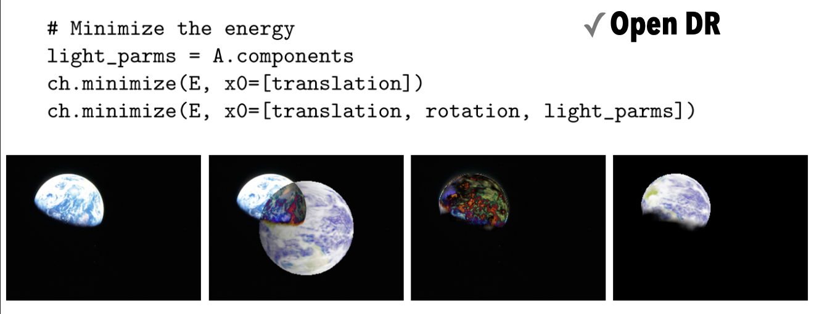
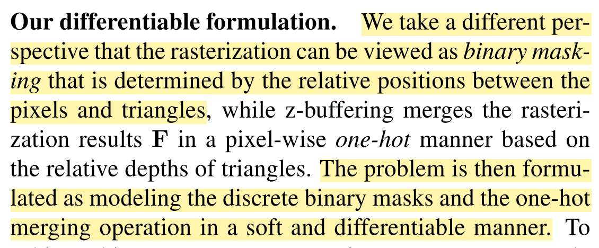
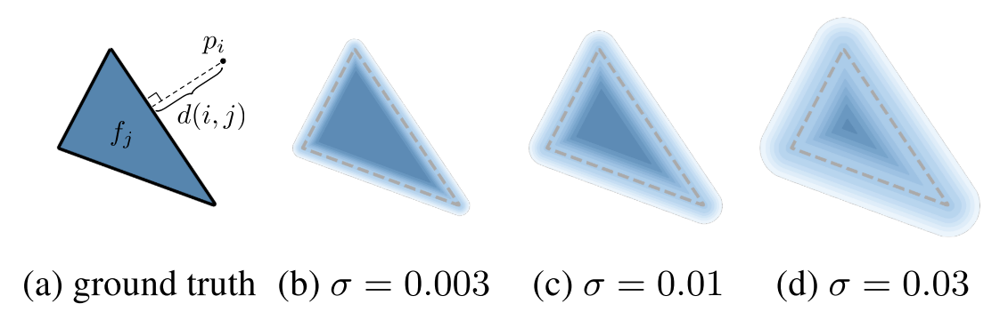
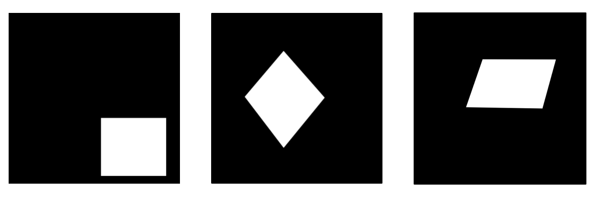

# 3D Graphics Systems Course - IMPA 2020

#### Professor Luiz Velho
#### Hallison Paz, 1st year PhD student
---------

## When AI renders a new Perspective in Graphics

This project builds on the previous assignments of 3D modeling and scene visualization using PyTorch3D, one of the AI graphics platforms available for free. 

> Our goal is to render a panoramic scene using a differentiable
> renderer and exploit the inverse rendering to augment a scene.

Most of the experiments can be found in the [rendering](https://colab.research.google.com/drive/1ggdaF0OFeAm9CTC1ZXiQFUnNxdgrrRWH?usp=sharing) or [de-rendering](https://colab.research.google.com/drive/16393ggQ6bzDhjda7pMBoMOAFluPzRSL-?usp=sharing) Google Colab notebooks. You can [download full results here](https://drive.google.com/drive/folders/1IUPjgpALrnlfuBMZir779LogZt2_ZxAR?usp=sharing).

### Motivation

As a personal goal, after some experience with traditional computer graphics and deep learning for computer vision using still images, I'm interested in understanding how to work with 3D data and artificial neural networks. From an external perspective, we see some very recent works applying deep learning in the context of omnidirectional representations [1, 2], which could lead to better VR/AR/XR applications and a huge impact in the audiovisual industry. This perspective of the future and my previous experience studying how we could use panoramic images for experiences in augmented or virtual reality [3] makes this theme look promising. 

<iframe width="560" height="315" src="https://www.youtube.com/embed/WsWqGsZDkzY" frameborder="0" allow="accelerometer; autoplay; encrypted-media; gyroscope; picture-in-picture" allowfullscreen></iframe>
*Layered Panorama Demo Application from* [3]

Rendering, or more specifically differentiable rendering, looks like a good topic to connect these areas as we'll see.

### Differentiable Rendering

Differentiable Rendering is not a technique but a whole field focused in rendering a 3D scene using a differentiable pipeline, which allows gradients to flow back and forth 3D objects and images. This is a great way to bridge computer graphics and computer vision problems and to train self supervised models. A good work to understand the idea behind this field is [4], which starts developing the idea from a very basic forward rendering or observation function $f(\theta)$ and an optimization process as stated in [4]:

> We define an observation function **f(Θ)** as the forward rendering
> process that depends on the parameters **Θ**. The simplest
> optimization would solve for the parameters minimizing the difference
> between the rendered and observed image intensities, $E(Θ) = ||f(\theta) − I||^2$.

With a differentiable renderer, we could calculate derivatives of the pixel values with respect to the forward rendering parameters and use it to estimate object pose, calibrate camera parameters or even optimize illumination to match a target scene. These examples ara not exhaustive.

*OpenDR example of optimization*[4]

Both [4] and [5] create differentiable renderers by crafting approximations for the gradients of the non differentiable steps of the rendering pipeline, that is, the rasterization and Z-buffer, and achieve good results. For our experiments, we used *Soft Rasterizer* [6] which presents a probabilistic formulation for the rasterization step and proposes the use of aggregation functions to overcome the need of sorting or Z-buffer to attribute the correct color to a pixel. Both [5] and [6] use neural networks to solve the forward and backward rendering problems.

*Soft Rasterizer Key Idea*

### Experiments and Analysis

The first experiments conducted were described during [assignment 2](assignment2.md). As we reached a point where we couldn't advance more due to the bug found in the PyTorch3D renderer, we decided to look for alternatives. Analyzing the references which inspired PyTorch3D, we found Soft Rasterizer [6], which had the code available on Github and a Paper describing the key ideas of the implementation.

#### Forward Rendering
Rendering our scene in Soft Rasterizer, we could see multiple artifacts in the resulting image, but the patterns rendered lead us to interpret the result as a consequence of bad parameters choice.

<iframe width="560" height="315" src="https://www.youtube.com/embed/kyR1mGCghvM" frameborder="0" allow="accelerometer; autoplay; encrypted-media; gyroscope; picture-in-picture" allowfullscreen></iframe>

We observed some spurious blurred triangles in the resulting images, so we decided to reduce the *sigma* parameter. As the parameter *sigma* goes to zero, we approximate the rasterization step of Soft Rasterizer to the traditional rasterization step. This approach produced better results and we finally were satisfied with the forward rendering step.

<iframe width="560" height="315" src="https://www.youtube.com/embed/qj5rVMbyVHc" frameborder="0" allow="accelerometer; autoplay; encrypted-media; gyroscope; picture-in-picture" allowfullscreen></iframe>

*Probability maps of a triangle with different sigma [6]*

#### Inverse Rendering

Although we weren't much confident, we decided to run an optimization test using only the texture of the scene and the euclidean distance as error. As expected, this setting is not enough to make the system converge as we don't have any geometric clue to optimize for.
 
<iframe width="560" height="315" src="https://www.youtube.com/embed/JXh1kySJtVg" frameborder="0" allow="accelerometer; autoplay; encrypted-media; gyroscope; picture-in-picture" allowfullscreen></iframe>

The second and most promising approach we experimented was to try to match an arbitrary object to a specific silhouette. We started analyzing how this could be done with a single plan, a very simple object, as this could be used to simulate the replacement of a picture inside the scene, for example.

<iframe width="560" height="315" src="https://www.youtube.com/embed/EwVNQiyL6vU" frameborder="0" allow="accelerometer; autoplay; encrypted-media; gyroscope; picture-in-picture" allowfullscreen></iframe>
*Optimizing vertices positions*

We tried some other silhouettes before figuring out the problem. We were trying to freely optimize the vertices positions, which produces a non rigid deformation of the object, but we are actually interested in applying a rigid transformation to locate objects inside the scene accordingly to an expected silhouette. 

*Other silhouettes that didn't work*

After these failed experiments, we concluded that the correct approach should be to optimize the object pose by computing an affine transform. The easiest and fastest way we could validate this idea was to optimize the camera pose, as this example was already implemented and we can see the object pose representation as the inverse transform of the camera pose representation.

<iframe width="560" height="315" src="https://www.youtube.com/embed/F8ttUv9-s_U" frameborder="0" allow="accelerometer; autoplay; encrypted-media; gyroscope; picture-in-picture" allowfullscreen></iframe>
*Optimizing camera pose*

Finally, we got a promising result! Optimizing the object transform is not so trivial as we have to parameterize the rotation space, but we think it could be done with a little more time and we intend to validate it in the future.

### Conclusion and next steps

We managed to complete the forward rendering step of our panoramic scene using the Soft Rasterizer. As we are working over early stages tools, we are subject to unexpected bugs as the one we found in PyTorch3D renderer. Fortunately, we could count on the original implementation and description of other approaches to keep our research going.

The results on camera pose optimization suggest we could optimize the pose of new 3d objects inside the panoramic environment. We think that with an appropriated parameterization of affine transforms, such as using quaternions for rotation and a simple vector for translation, we could achieve promising results. This conjecture needs further investigation in a future work.

### References

[1] Michael Broxton, John Flynn, Ryan Overbeck, Daniel Erickson, Peter Hedman, Matthew DuVall, Jason Dourgarian, Jay Busch, Matt Whalen and Paul Debevec; **Immersive Light Field Video with a Layered Mesh Representation**. ACM Trans. Graph. 39, 4, Article 1 (July 2020).

[2] Daniel Martin, Ana Serrano and Belen Masia; **Panoramic convolutions for 360º single-image saliency prediction**. CVPR Workshop on Computer Vision for Augmented and Virtual Reality, 2020.

[3] Carlos Eduardo Rocha, Diego Bretas, Hallison da Paz, Paulo Rosa, and Luiz Velho. **Framework para Aplicações em Plataformas Móveis usando Panoramas com Camadas**. Technical Report TR-04-2014, IME, 2014. ([Portuguese only](http://www.visgraf.impa.br/Data/RefBib/PS_PDF/tr-042014/tr-04-2014.pdf))

[4] M. M. Loper and M. J. Black. **Opendr: An approximate differentiable renderer**. In European Conference on Computer Vision, pages 154–169. Springer, 2014.

[5] H. Kato, Y. Ushiku, and T. Harada. **Neural 3d mesh renderer**. In Proceedings ofthe IEEE Conference on Computer Vision and Pattern Recognition, pages 3907–3916, 2018.

[6] Liu, S., Li, T., Chen, W., Li, H.: **Soft rasterizer: A differentiable renderer for image-based 3d reasoning**. In: Proceedings of the IEEE International Conference on Computer Vision. pp. 7708–7717 (2019)

###### You may contact me at hallpaz@impa.br
<!--stackedit_data:
eyJoaXN0b3J5IjpbLTIxMjQyNDcyMjQsLTEwMjU2MDM2MjgsMT
U0Njk4ODYyLDEwMjEzNTg1NzksLTE5MzcwOTYyOTgsMzI5ODEw
NTg2LDIxMDQwNjI1NjgsLTY1NDc3NzM4MSwtMjc5NzcyMzg1LD
QyOTMzNzM2MywxOTI1Mjc1MDM1LC01ODcxOTQ2MzcsLTc5Mjgw
OTgyMiw5OTI2OTU0NDgsMzU0Nzg0MjQwLC0xNzg2MzQ4Nzg4LD
E1MTU3ODI0MDgsLTIwNTczMTg3NDMsLTg3MjM0NzQxMiwzNjI2
OTk0MDhdfQ==
-->
